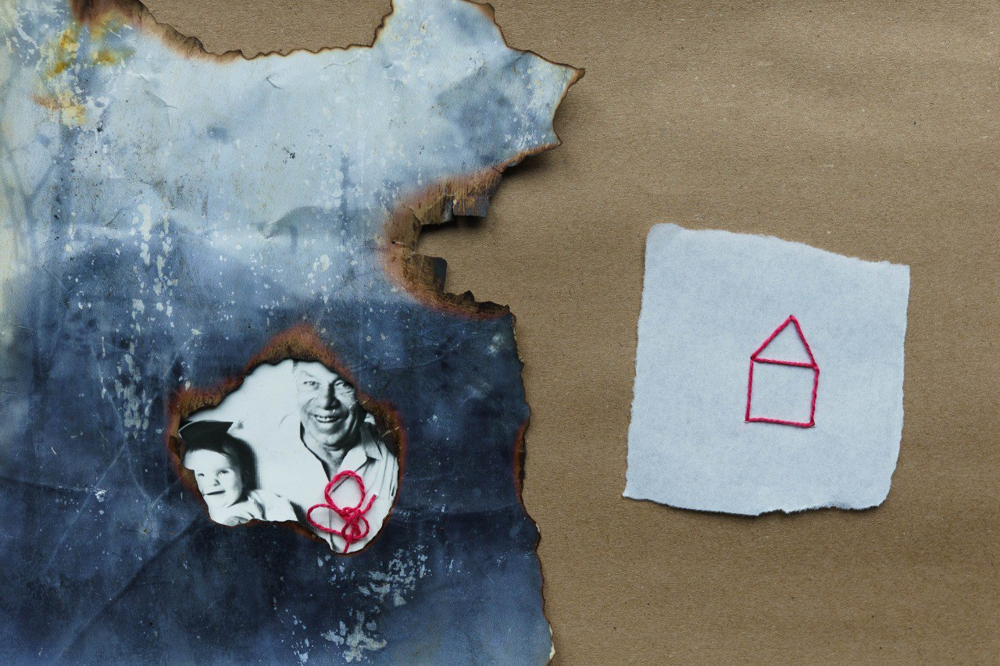
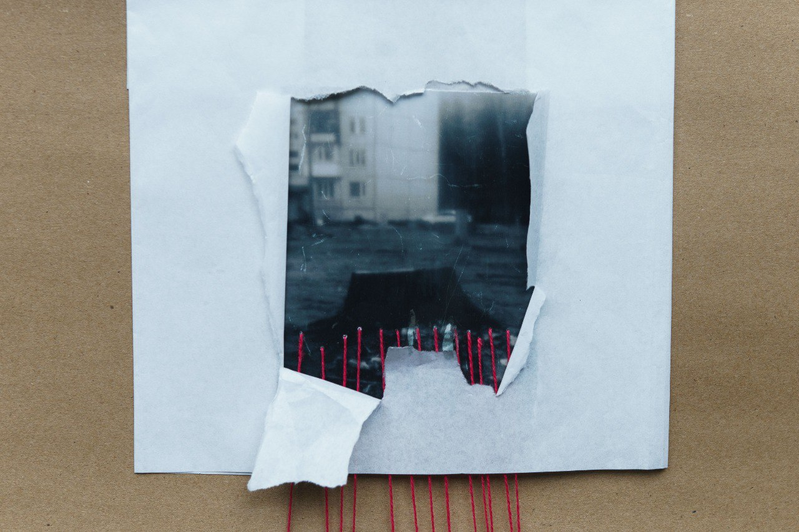
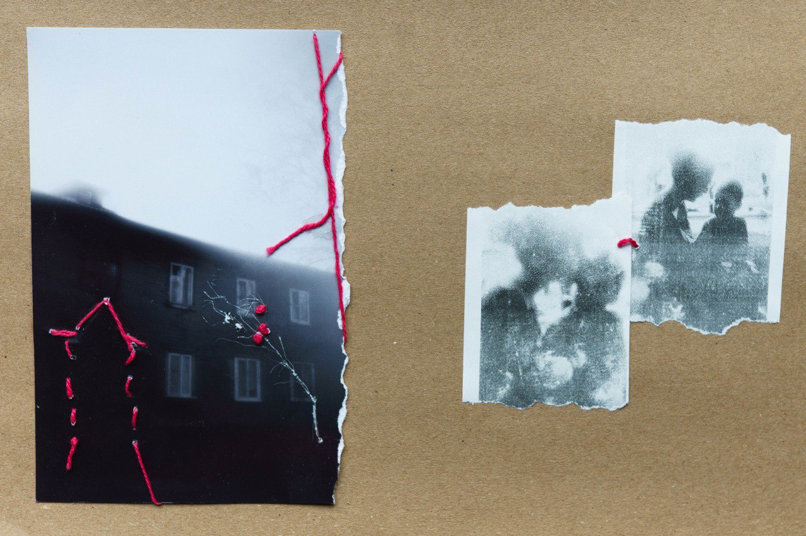
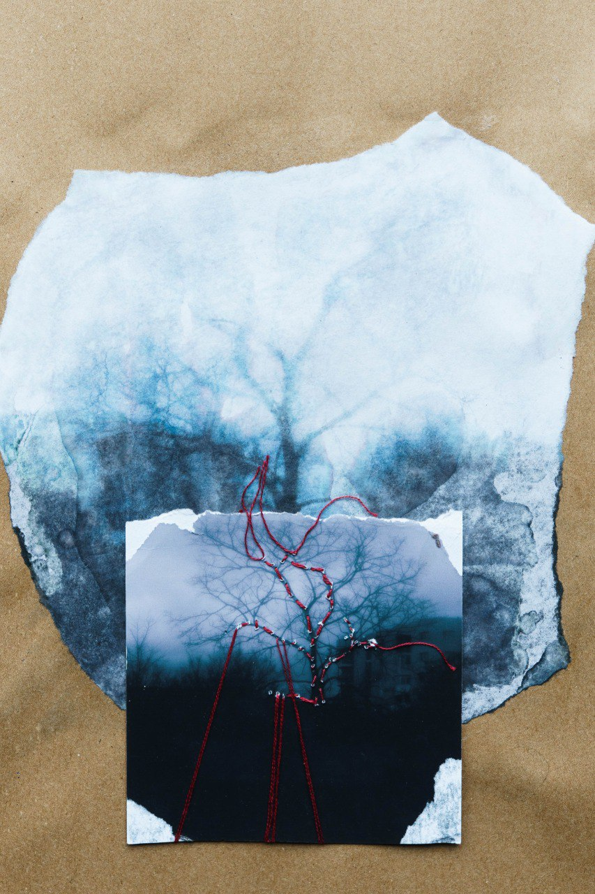
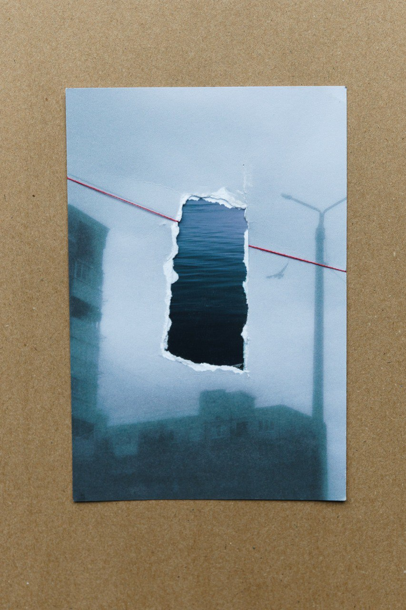
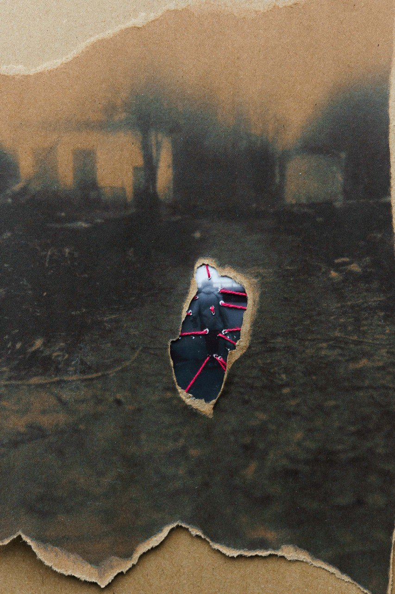
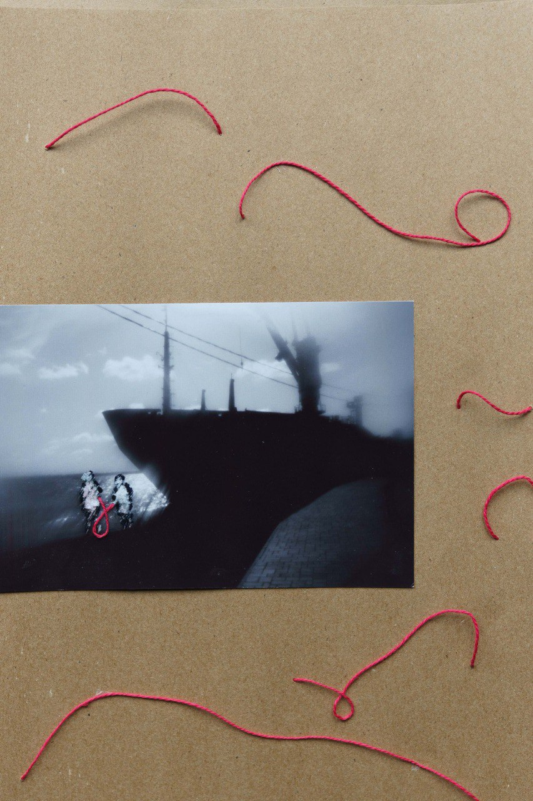
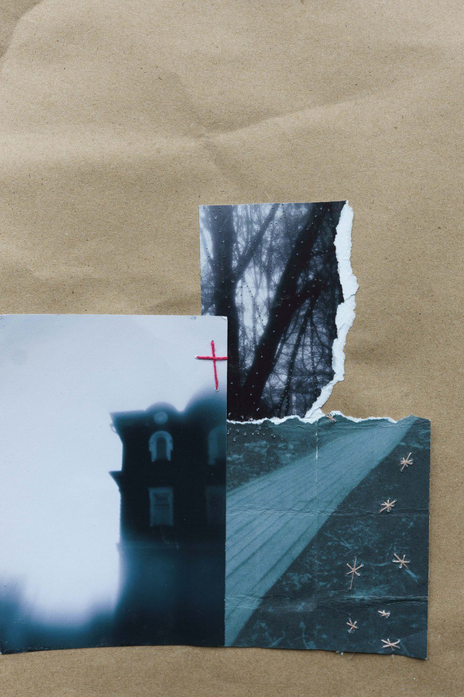
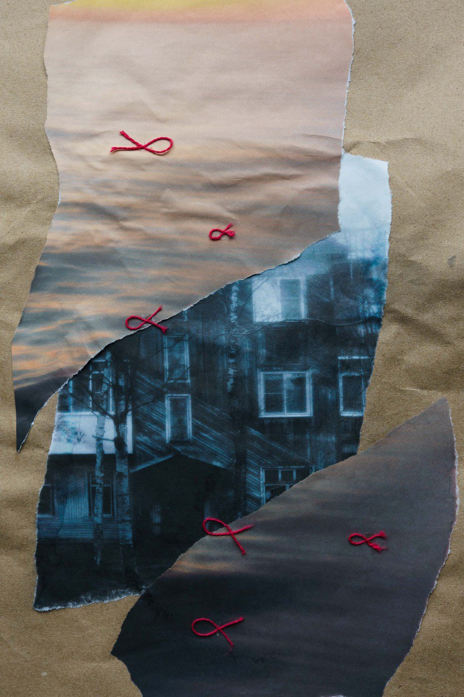

# Дом сердца

Проект посвящен потере дома при переезде из малой Родины. 

Я живу в маленьком городе на Севере. Здесь, как и в других провинциальных городах, остро стоит проблема оттока населения.

Регулярно отсюда уезжают люди: кто ищет лучшей жизни, а кто бежит от долгой холодной зимы. Некоторые мечтают о переезде, но не могут решиться: престарелые родственники, жильё, стабильная работа, корни, которые держат.

Люди, уехавшие из родного города, теряют свой дом — место, где прошло их детство. 

Дом — это тепло, это мама, которая ждет тебя с прогулки, это милые мелочи, секретики, старые игрушки.

Дом — это улица, где ты вырос, знакомые заросшие тропинки, двор и друзья.

Всё это остаётся в прошлом, в светлых воспоминаниях.

Тем временем город живёт и меняется: многоэтажные муравейники вырастают на месте сгоревших деревянных домов. Когда этих домов не останется, уйдет и память. О доме. И о тех, кто там когда-то жил.

С этим проектом связана и моя личная история. Я переехала на Север из другого региона в 11 лет. Все мои игрушки, рисунки, тетрадки остались там. Там же остались и бабушка с дедушкой. Дом, в котором мы жили, я больше никогда не видела. Только во сне.

