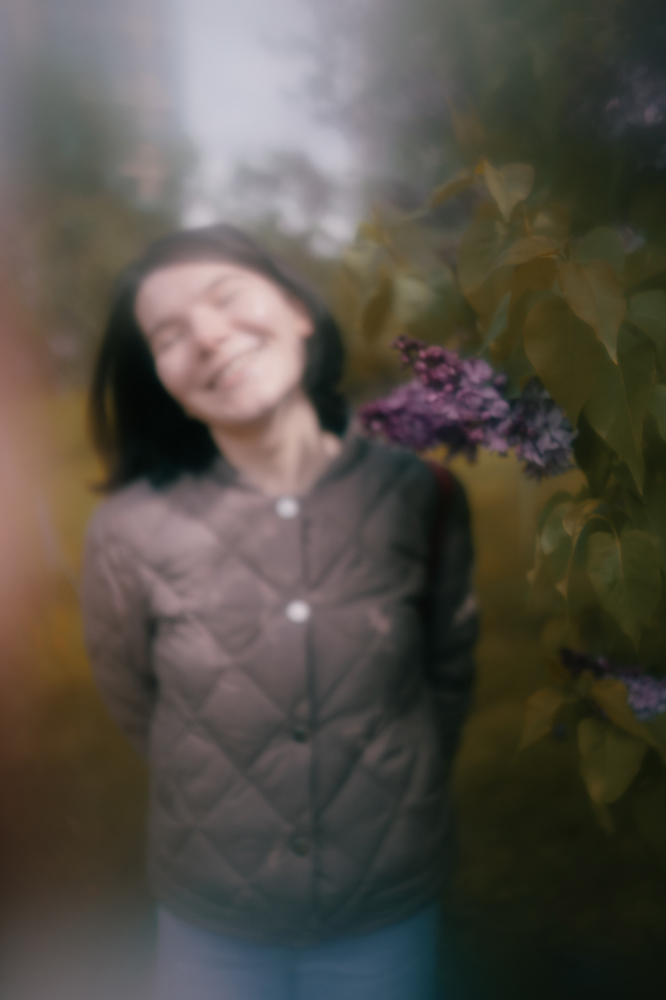

---
hide:
  - toc
---
# Обо мне

## Тёплым тихим утром...

!!! quote ""
    

!!! info ""
    Привет, меня зовут Саша, я фотограф из Архангельска. Меня интересуют противоречия и иллюзии нашего мира, я исследую параллельные   реальности и серую зону между ними. С помощью своего объектива я стремлюсь запечатлеть странные и сюрреалистические моменты, которые часто остаются незамеченными, заставляя зрителя сомневаться в своем восприятии и убеждениях. Для меня фотография - это инструмент для навигации по переходам и связям между различными энергиями и мирами. Это способ принять странные и загадочные аспекты нашей вселенной. Присоединяйтесь ко мне в этом путешествии в зазеркалье и давайте вместе исследуем размытые грани.

    Мои контакты: [vk.com](https://vk.com/tihimutrom){target=_blank}

