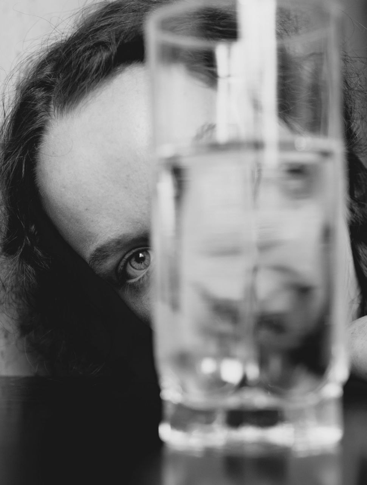
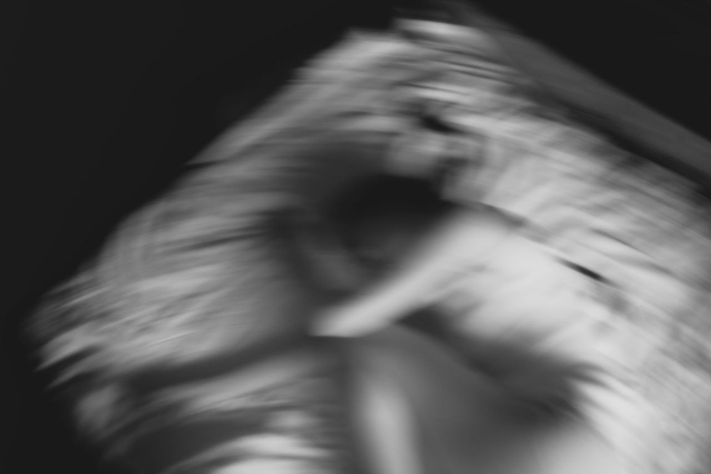
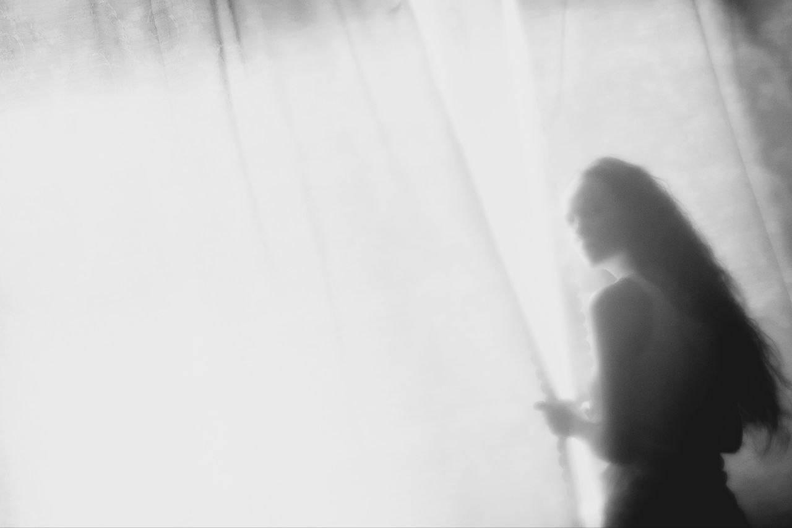

# Взросление

Взросление — это история превращения девочки в женщину, которая распоряжается своей жизнью самостоятельно. Это время первых сложных решений, сепарации от родителей, непростого выбора, столкновений со взрослой реальностью и разбитыми иллюзиями. Но также это время надежд на будущую прекрасную жизнь, полную свободы и радости. Героиня этой истории проходит сложный этап становления личности, сталкивается с непониманием родителей и общества, борется за право иметь свой голос в этом мире.
Одновременно с этим молодая девушка познаёт себя, принимает особенности своего тела, своего уникального характера. 
Взросление - это история каждой из нас. История женщин, не боящихся меняться, говорить, делать выбор и менять мир.

