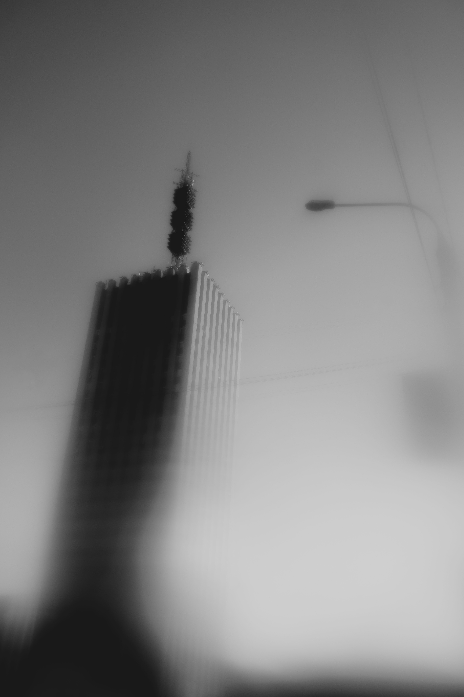
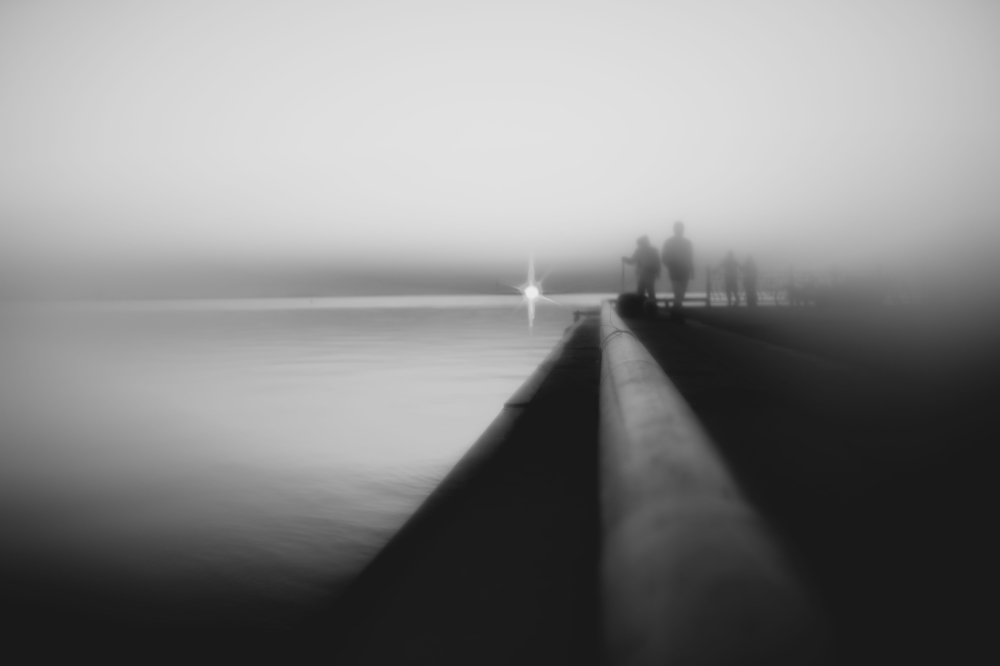
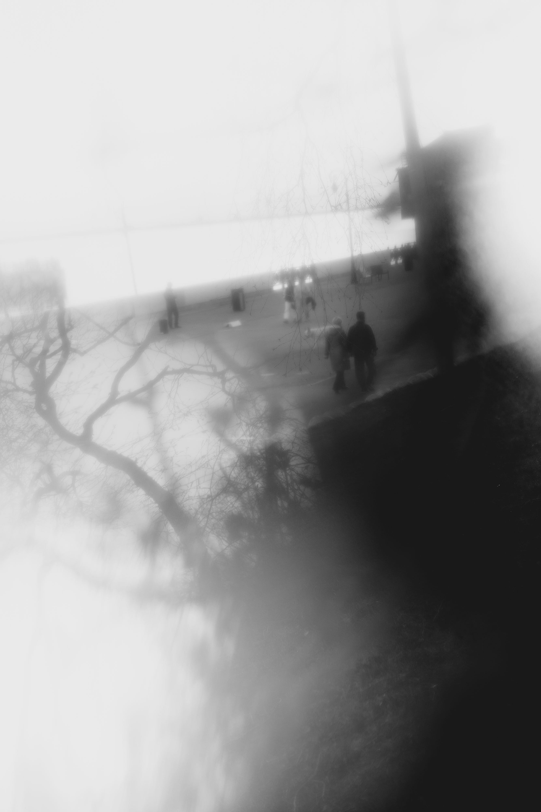
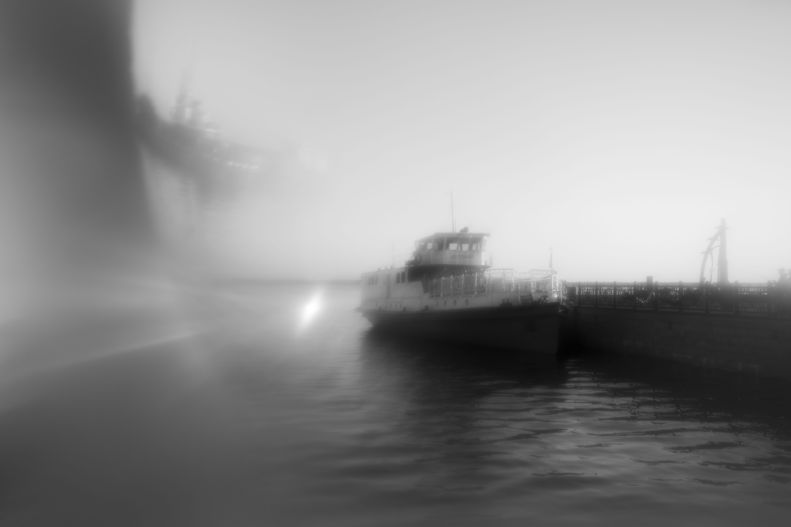
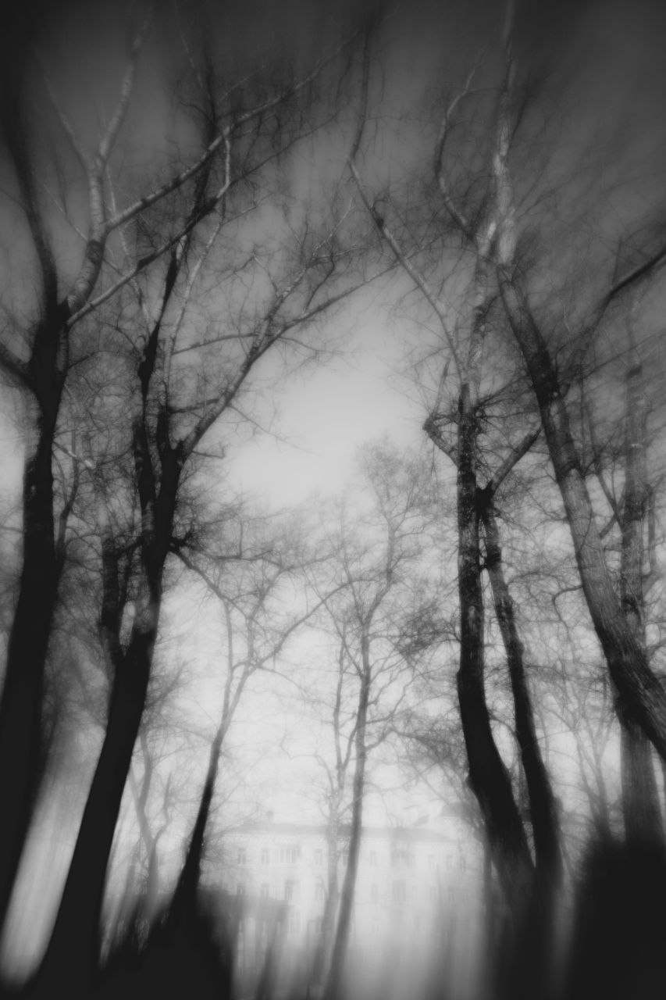

# Город, который мне приснился

В творчестве, в том числе визуальном, мне очень нравится фантазировать. Через фотографию я вижу мир на грани сна и реальности. Мне нравится ощущение сна, когда знакомые места и вещи видоизменяются, но остаются родными, уютными.

Так и  в этой работе, две ипостаси совместились: узнаваемые символы Архангельска сочетаются с неустойчивой дымкой иллюзии.
Я гуляла по городу я снимала всё вокруг, а объектив искажал пространство, проявляя тот самый сон.

